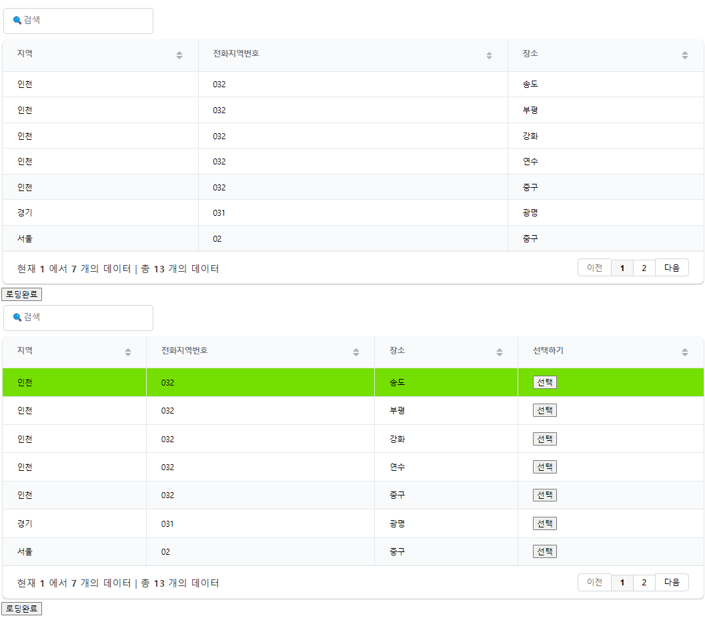

# BasicGridJS

> 공통함수화로 코드의 재사용을 최소화.



## 파일
> gridJS는 최신버전 사용을 권장, 내장된 gridJS를 기반으로 만든 basicGridJS파일임.

1. GridJS.js 관련 js파일
2. GridJS CSS파일
3. basicGridJS 파일
4. 예제 HTML파일

## 구현기능
1. `draw()`시 페이지네이션 초기화 문제 해결
2. 사용자지정 하이라이트(예시로 사진의 첫번째표의 `중구` 부분 하이라이트)
3. `선택`버튼을 누른 행 하이라이트
4. 수동적 `Loading`(데이터를 가져온후 추가적인 데이터파싱이필요할 경우 유용)
5. 한글화

## 사용 순서
0. `$.extend(true,<TARGET>,basicGridJS);`으로 덮어씌워 사용
1. `init`으로 grid가 보여질 태그ID지정 및 속성정의
2. `getData`으로 `Ajax`(혹은 다른방법)데이터를 가져옴
3. `draw`으로 테이블을 그림

## GridJS의 옵션들
> 공통 테이블의 기본 옵션을 변경하려면 `basicGridJS`에서 기본 속성을 변경할 수 있음.

> 하나의 테이블만 속성을 변경하려면 `init`에서 `customConfig`으로 해당 테이블만 속성을 변경할 수 있음.

🔍[GridJS Docs](https://gridjs.io/docs)

## 문제점
1. 테이블을 `SORT`시켜놓고 다시 `draw()`할경우 `SORT`가 초기화됨
2. 테이블의 특정 페이지에서 다시 `draw()`할경우 특정페이지로 돌아가지않음
    - 비공식적인 방법으로 해결함.

## 응용 및 용도
- 프로젝트의 특성에 맞게 `basicGridJS`에 Grid관련 공통함수 추가작성 가능
- 코드의 재사용성을 낮춰 코드를 간결화
- 쉬운사용(?)

## getData -> ajax 사용법
```JavaScript
var sampleData = []
var testGrid = {
    ...,
    getData: function(){
        $.ajax({
            url: 'url',
            method: 'get || post || ...',
            contentType:"application/json",
            ...
            success: function (data, status, xhr) {

                ... // (필요시)데이터 파싱작업.

                // 선택 하이라이트를 사용하지 않는경우
                testGrid.data = data;

                // 선택 하이라이트를 사용하는 경우
                testGrid.data = testGrid2.makeSelection(data, "SELECTED")

                testGrid.loaded();

            },
            error: function (data, status, err) {
                ...
            },
            complete: function () {
                ...
            }
        });
    
        testGrid.setGridLoadData();
        testGrid.draw(); //테이블 그리기
    }
}
```

## GRID JS LICENSE
```
MIT License

Copyright (c) Afshin Mehrabani <afshin.meh@gmail.com>

Permission is hereby granted, free of charge, to any person obtaining a copy
of this software and associated documentation files (the "Software"), to deal
in the Software without restriction, including without limitation the rights
to use, copy, modify, merge, publish, distribute, sublicense, and/or sell
copies of the Software, and to permit persons to whom the Software is
furnished to do so, subject to the following conditions:

The above copyright notice and this permission notice shall be included in all
copies or substantial portions of the Software.

THE SOFTWARE IS PROVIDED "AS IS", WITHOUT WARRANTY OF ANY KIND, EXPRESS OR
IMPLIED, INCLUDING BUT NOT LIMITED TO THE WARRANTIES OF MERCHANTABILITY,
FITNESS FOR A PARTICULAR PURPOSE AND NONINFRINGEMENT. IN NO EVENT SHALL THE
AUTHORS OR COPYRIGHT HOLDERS BE LIABLE FOR ANY CLAIM, DAMAGES OR OTHER
LIABILITY, WHETHER IN AN ACTION OF CONTRACT, TORT OR OTHERWISE, ARISING FROM,
OUT OF OR IN CONNECTION WITH THE SOFTWARE OR THE USE OR OTHER DEALINGS IN THE
SOFTWARE.
```